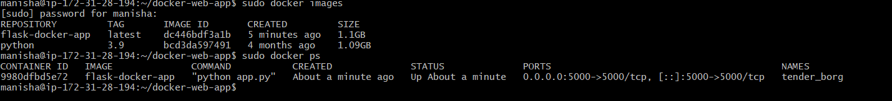
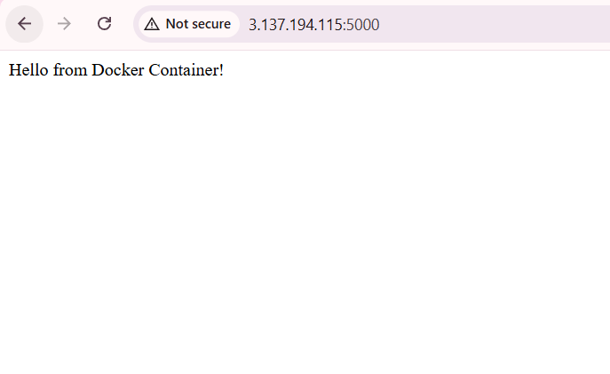

# Dockerizing a Flask Web Application

This project demonstrates how to containerize a simple Python Flask web application using Docker.

## 🚀 Project Overview

In this project, a simple Flask application is packaged into a Docker container. Docker ensures the application runs consistently across different environments.

## 🛠 Technologies Used

- Python
- Flask
- Docker
- Dockerfile
- Containerization

## 📂 Project Structure

docker-web-app
│
├── app.py
├── requirements.txt
├── Dockerfile
├── README.md
└── screenshots

## ⚙️ How to Run This Project

1. Clone the repository

git clone https://github.com/YOUR_USERNAME/docker-web-app.git

2. Navigate to the project directory

cd docker-web-app

3. Build the Docker image

docker build -t flask-docker-app .

4. Run the Docker container

docker run -p 5000:5000 flask-docker-app

5. Open browser

http://<public-ip>:5000

You should see:

Hello from Docker Container!

## 📸 Project Screenshots

### Docker Images & Container

### Web Application Running

## 📚 Learning Outcomes

- Understanding Docker fundamentals
- Writing a Dockerfile
- Building Docker images
- Running applications in containers
- Exposing container ports
